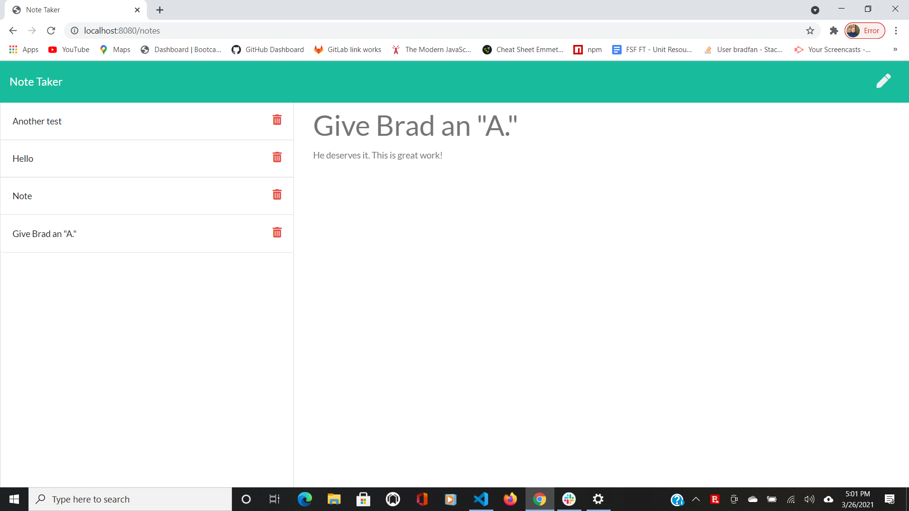

Github Link: https://bradfan.github.io/Note-Taker/

When the user opens the Note Taker they are presented with a landing page with a link to a notes page. When they click on the link to the notes page they are presented with a page with existing notes listed in the left-hand column, plus empty fields to enter a new note title and the note’s text in the right-hand column. When they enter a new note title and the note’s text, a Save icon appears in the navigation at the top of the page. When they click on the Save icon, the new note they have entered is saved and appears in the left-hand column with the other existing notes. When they click on an existing note in the list in the left-hand column, that note appears in the right-hand column. When they click on the Write icon in the navigation at the top of the page they are presented with empty fields to enter a new note title and the note’s text in the right-hand column.

